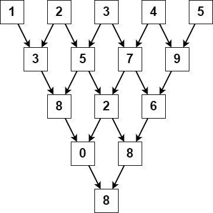

# Triangular Sum of an Array

You are given a **0-indexed** integer array `nums`, where `nums[i]` is a digit between **0 and 9** (inclusive).

The **triangular sum** of `nums` is the value of the only element present in `nums` after the following process terminates:

### Process:
1. Let `nums` comprise of `n` elements. If `n == 1`, end the process.
2. Otherwise, create a new **0-indexed** integer array `newNums` of length `n - 1`.
3. For each index `i`, where `0 <= i < n - 1`, assign the value of `newNums[i]` as:

``newNums[i] = (nums[i] + nums[i+1]) % 10``

where `%` denotes the modulo operator.
4. Replace the array `nums` with `newNums`.
5. Repeat the entire process starting from **step 1**.

### Output:
Return the **triangular sum** of `nums`.

### Example 1


**Input:**  
```plaintext
nums = [1,2,3,4,5]
```

**Output:**
```
8
```

**Explanation:**
The above diagram depicts the process from which we obtain the triangular sum of the array.

### Example 2

**Input:**  
```
nums = [5]
```

**Output:**
```
5
```

**Explanation:**
Since there is only one element in nums, the triangular sum is the value of that element itself.